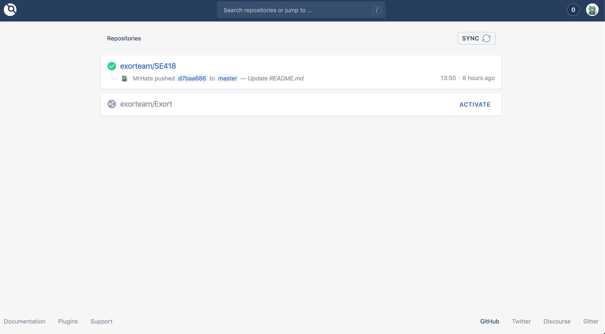
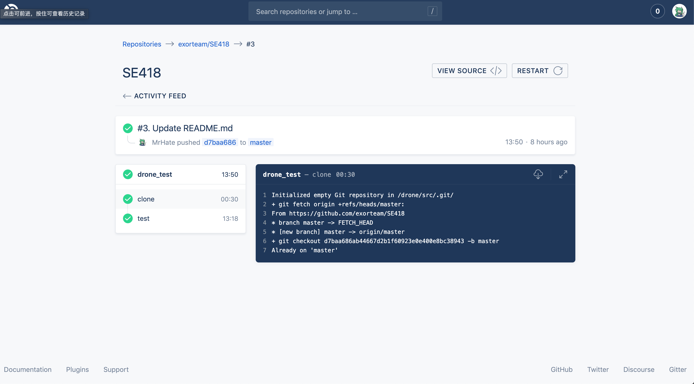

# We choose Drone as our CI

## To deploy Drone, steps are below:

1. A server is needed, with at least 2GB main memory.
2. Install Docker on your server, run

	`sudo apt update`
	
	`sudo apt install docker.io`
	
	`sudo apt install docker-compose`
	
3. Install Drone on your server, run

	`sudo docker pull drone/drone:1`
	
4. Create a OAuth App with your Github Account
4. Write a docker-compose.yaml for Drone

	```
		version: "2"
		services:
		  drone-server:
			image: drone/drone:1
			ports:
			  - 80:80
			  - 443:443
			volumes:
			  - ./drone:/var/lib/drone/
			  - /var/run/docker.sock:/var/run/docker.sock
			restart: always
			environment:
			  - DRONE_GITHUB=true
			  - DRONE_GITHUB_SERVER=https://github.com
			  - DRONE_GITHUB_CLIENT_ID=
			  - DRONE_GITHUB_CLIENT_SECRET=
			  - DRONE_SERVER_HOST=
			  - DRONE_SERVER_PROTO=http
			  - DRONE_REPOSITORY_FILTER=
	```
	
5. Run Drone

	`sudo docker-compose up -d`
	
6. Activate certain repository and write a **.drone.yml** in that repository

	```
		kind: pipeline
		name: drone_test

		steps:
		- name: test
		  image: maven:latest
		  commands:
		  - cd demo
		  - mvn clean test
		  volumes:
		  - name: ci-test
			path: /ci
		  when:
			event:
			- push
	```

## Screen shots



## reference
1. [Drone 1.0 official docs](https://docs.drone.io/)
2. [Drone on Github](https://github.com/drone)
3. [SE418 Sample](https://github.com/linxuyalun/devops)
